# [SQL MASTERY HOME PAGE 🏠](../../README.md)

- [SQL MASTERY HOME PAGE 🏠](#sql-mastery-home-page-)
  - [1. What Is a Database 🐸](#1-what-is-a-database-)
  - [2. I Didn't Learn Anything, Try Again 🐹](#2-i-didnt-learn-anything-try-again-)
    - [2.1 Drum Memory 🦊](#21-drum-memory-)
  - [3. Database Management System (DBMS) 🦝](#3-database-management-system-dbms-)
  - [4. Exercise Building Amazon 🐮](#4-exercise-building-amazon-)
    - [4.1 SQL Playground 🐷](#41-sql-playground-)
  - [5. Exercise Building Amazon 2 🦤](#5-exercise-building-amazon-2-)
  - [6. 5 Types Of Databases 🦁](#6-5-types-of-databases-)
    - [6.1 Database Types Deep Dive 🐯](#61-database-types-deep-dive-)
  - [7. Exercise What Is A Database 🤖](#7-exercise-what-is-a-database-)
  - [8. Section Review 🐱](#8-section-review-)

## 1. What Is a Database 🐸

data is everywhere?
companies that have the most data are the companies that are valued the most.
like facebook.

most companies collect lots od data.

usually data is collected in a hard drives

## 2. I Didn't Learn Anything, Try Again 🐹

most databases icons related to a drum memory.

reason is the use of drum memory.

we can use excel to manage data for a sum capacity.
but they are limited to a sum extent.

these are the most popular database options.

- you have product manager.
- you have marketing.
- you have developers.
- you have data scientist.
- you have database administrators.

all those people use the database differently.

### 2.1 Drum Memory 🦊

[Drum Memory stackoverflow link](https://stackoverflow.com/questions/2822650/why-is-a-database-always-represented-with-a-cylinder)

## 3. Database Management System (DBMS) 🦝

we use sql to communicate with the database management systems.

## 4. Exercise Building Amazon 🐮

let's first use excel

now data is getting complecated.

now the data is getting bigger and bigger.

database example.

### 4.1 SQL Playground 🐷

[w3schools sql playground](https://www.w3schools.com/sql/trysql.asp?filename=trysql_op_in)

## 5. Exercise Building Amazon 2 🦤

so the excel is not working for him. so he is using a database like postgres.

## 6. 5 Types Of Databases 🦁

### 6.1 Database Types Deep Dive 🐯

## 7. Exercise What Is A Database 🤖

## 8. Section Review 🐱

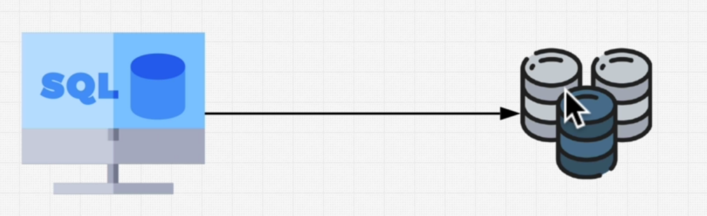

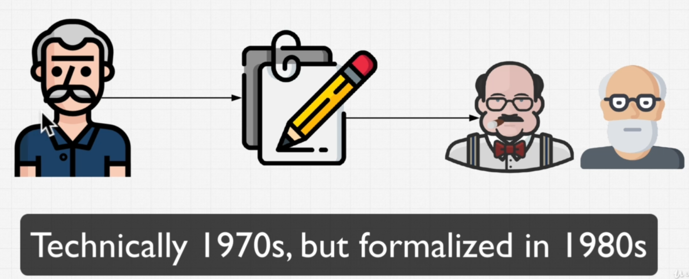

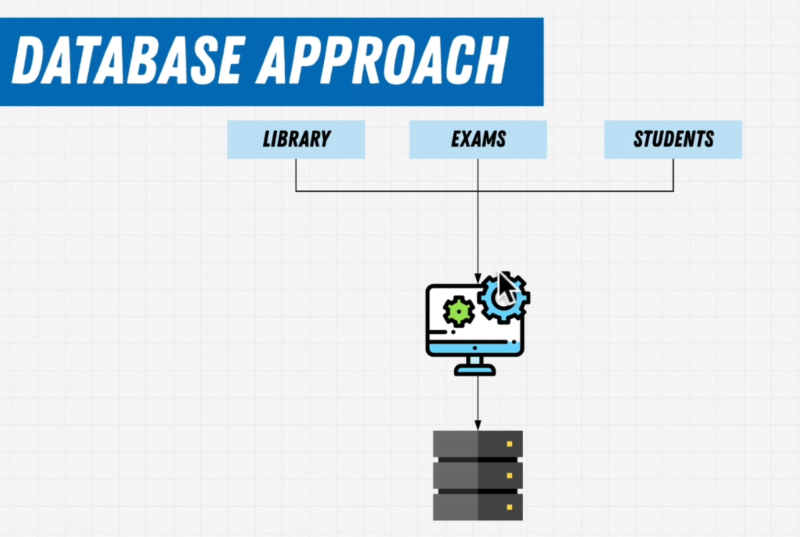

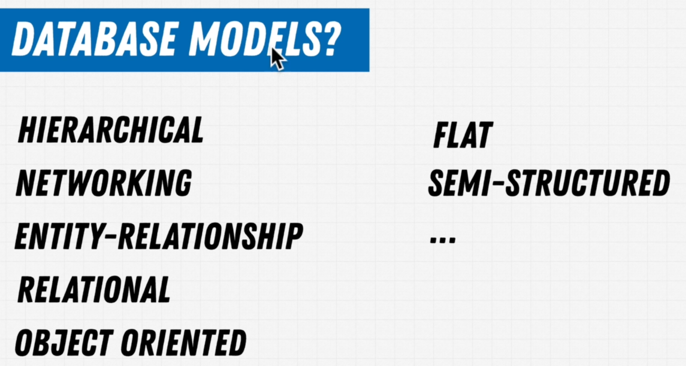

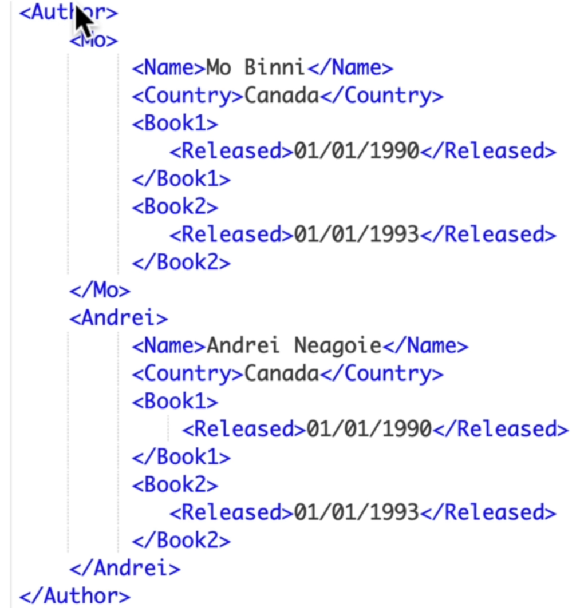
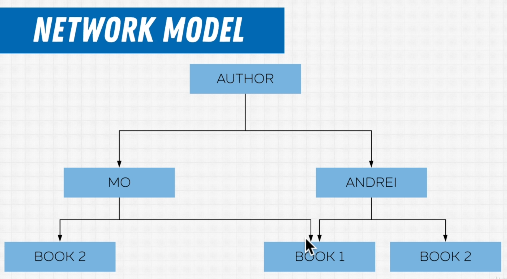

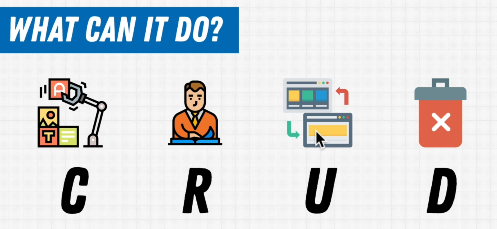

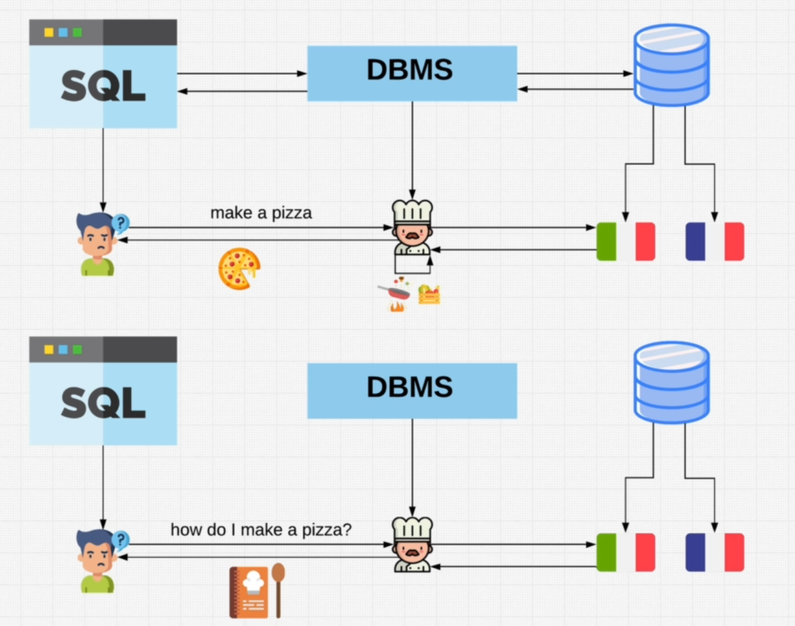

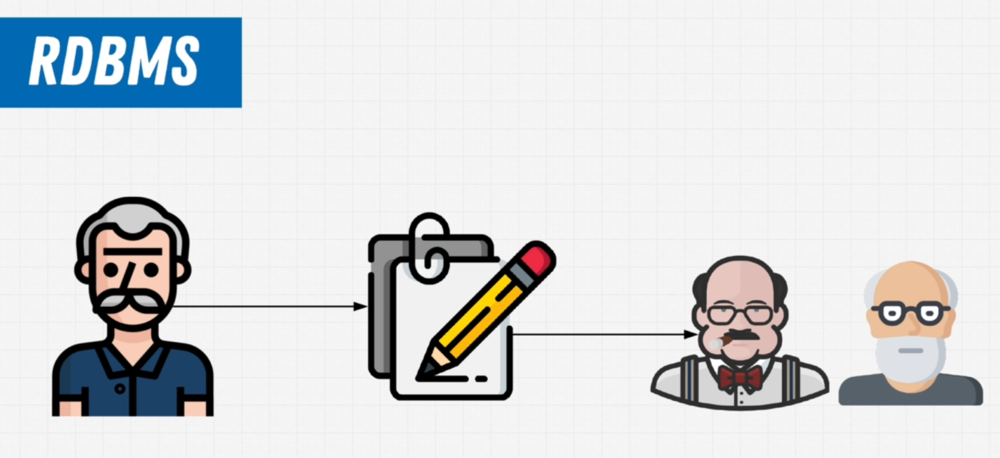
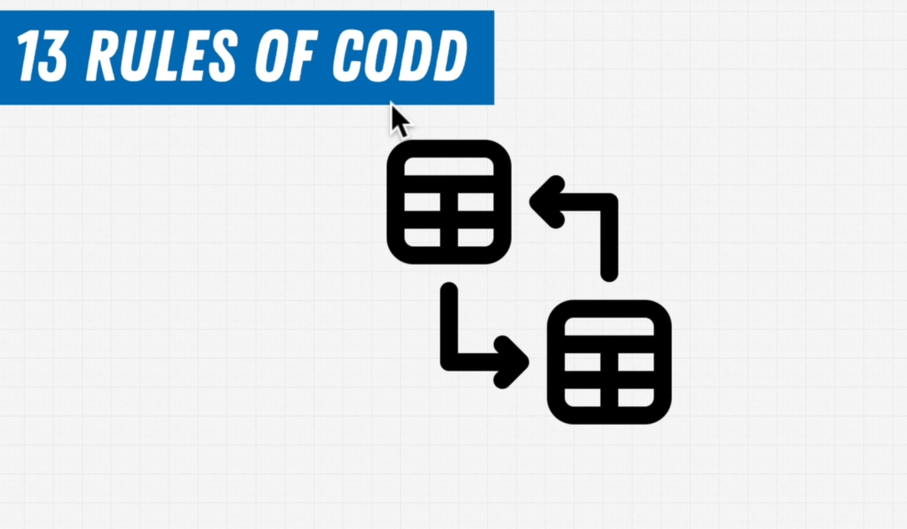

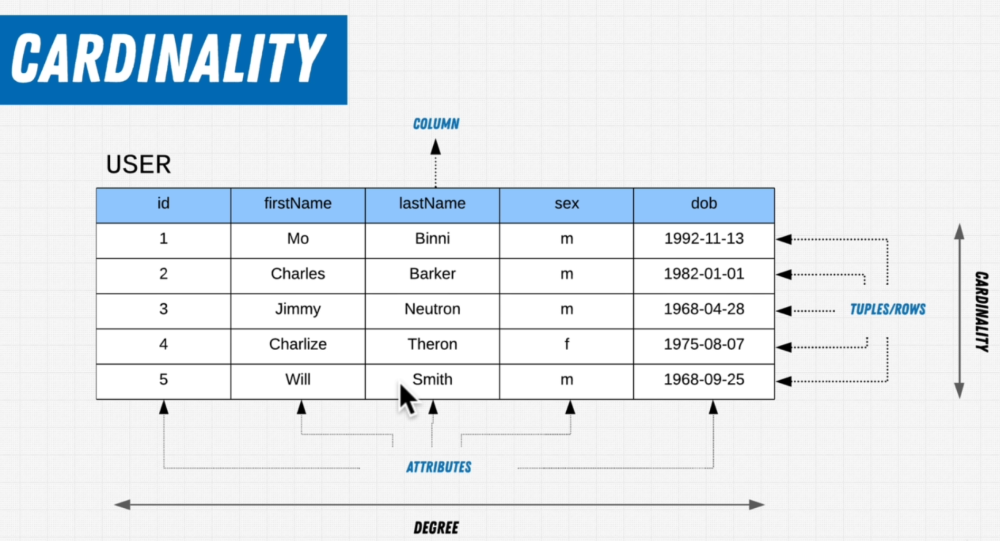
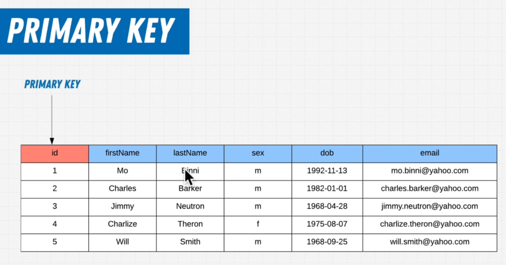

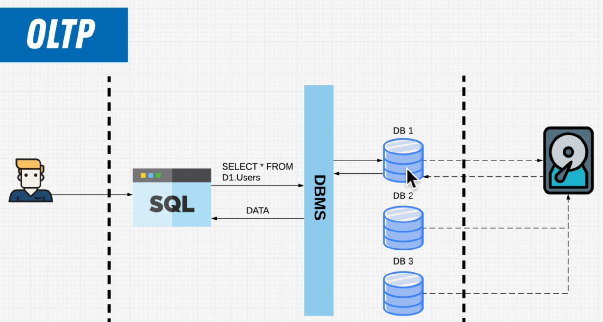
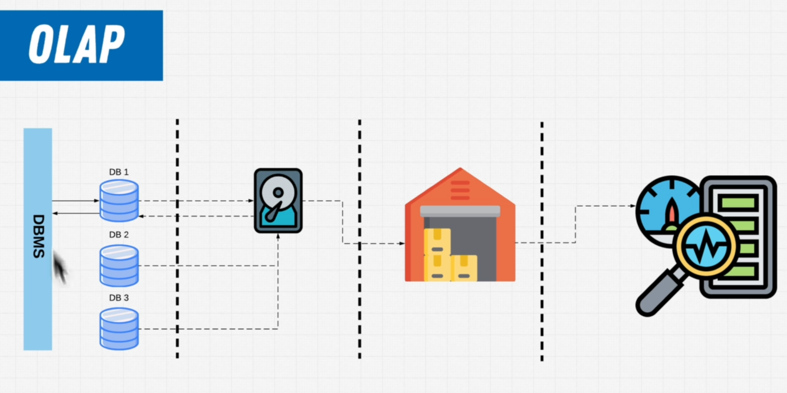

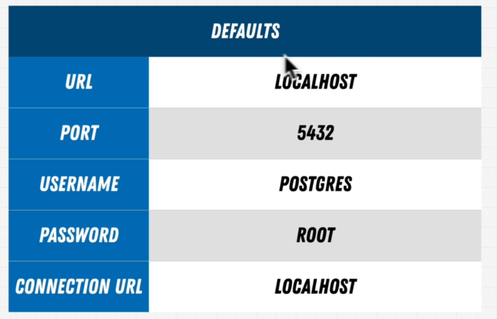

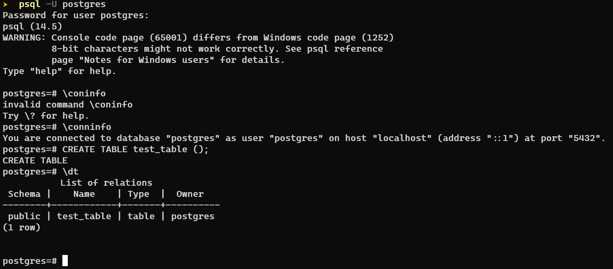

