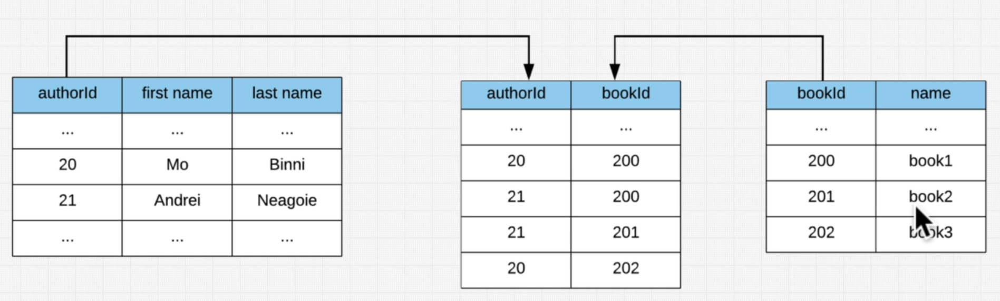

# [SQL MASTERY HOME PAGE 🏠](../../README.md)

- [SQL MASTERY HOME PAGE 🏠](#sql-mastery-home-page-)
  - [1. SQL Playground 🐼](#1-sql-playground-)
  - [2. SQL Playground 🐷](#2-sql-playground-)
  - [3. Exercise Setting Up Your First Database 🦝](#3-exercise-setting-up-your-first-database-)
    - [Query](#query)
  - [4. What Is SQL 🐸](#4-what-is-sql-)
    - [what is sql](#what-is-sql)
  - [5. What Is A Query](#5-what-is-a-query)
    - [Query #1](#query-1)
    - [Query #1](#query-1-1)
    - [4.1 DBFiddle 🐼](#41-dbfiddle-)
  - [5. Imperative vs Declarative 🐼](#5-imperative-vs-declarative-)
  - [6. History of SQL 🐼](#6-history-of-sql-)
  - [7. Exercises The Select Statement 🐼](#7-exercises-the-select-statement-)
  - [8. Optional History of SQL Deep Dive 🐼](#8-optional-history-of-sql-deep-dive-)
  - [9. SQL Standards 🐼](#9-sql-standards-)
  - [10. What Is A Database Revisited 🐼](#10-what-is-a-database-revisited-)
  - [11. Database Oriented Approach 🐼](#11-database-oriented-approach-)
  - [12. Exercise SQL Starter Quiz 🐼](#12-exercise-sql-starter-quiz-)
  - [13. Database Models 🐼](#13-database-models-)
  - [14. Hierarchical And Networking Model 🐼](#14-hierarchical-and-networking-model-)
  - [15. Relational Model 🐼](#15-relational-model-)
  - [16. DBMS Revisited 🐼](#16-dbms-revisited-)
    - [16.1 12 Rules of Codd 🐼](#161-12-rules-of-codd-)
  - [17. Relational Model Revisited 🐼](#17-relational-model-revisited-)
  - [18. Tables 🐼](#18-tables-)
  - [19. Columns 🐼](#19-columns-)
  - [20. Rows 🐼](#20-rows-)
  - [21. Primary And Foreign Keys 🐼](#21-primary-and-foreign-keys-)
  - [22. OLTP vs OLAP 🐼](#22-oltp-vs-olap-)
  - [23. Exercise OLTP vs OLAP 🐼](#23-exercise-oltp-vs-olap-)
  - [24. Exercise Relational Model Quiz 🐼](#24-exercise-relational-model-quiz-)
  - [25. Endorsements On LinkedIN 🐼](#25-endorsements-on-linkedin-)

## 1. SQL Playground 🐼

Alright!!! It's time to do your setup your first database, if you go to the following link you'll be able to see a simple DBFiddle!

We've already setup some test tables and and put in some test data for you so there's no need to focus on that part!

We've also added some simple queries that will have a comment right next to the SELECT keyword, feel free to remove this comment (the part between the /\* \*/).

[db fiddle link](https://www.db-fiddle.com/f/7fnLq7sZNknYPfm6U2xEAH/0)

**Schema (PostgreSQL v12)**

```sql

    CREATE TABLE Class (
      id character(255),
      year integer NOT NULL,
      PRIMARY KEY(id)
    );

    CREATE TABLE Student (
      id varchar(255) NOT NULL,
      class varchar(255) NOT NULL,
      firstName varchar(255) NOT NULL,
      lastName varchar(255) NOT NULL,
      dob date NOT NULL,
      sex varchar(1) NOT NULL,
      FOREIGN KEY (class) REFERENCES Class(id),
      PRIMARY KEY (id)
    );

    INSERT INTO Class(id, year) VALUES('c1', 1);
    INSERT INTO Class(id, year) VALUES('c2', 2);
    INSERT INTO Class(id, year) VALUES('c2a', 2);

    INSERT INTO Student
    VALUES ('s1', 'c1', 'George', 'Jacobson', '1992-01-01', 'm');

    INSERT INTO Student
    VALUES ('s2', 'c2', 'Macy', 'Waterson', '1992-01-01', 'f');

    INSERT INTO Student
    VALUES ('s3', 'c1', 'Bill', 'Peters', '1992-01-01', 'm');


    INSERT INTO Student
    VALUES ('s4', 'c1', 'Janine', 'Wilson', '1992-01-01', 'f');


    INSERT INTO Student
    VALUES ('s5', 'c2', 'Jason', 'Lipton', '1992-01-01', 'm');

```

**Query #1**

```sql
SELECT id,firstName
FROM Student;
```

| id  | firstname |
| --- | --------- |
| s1  | George    |
| s2  | Macy      |
| s3  | Bill      |
| s4  | Janine    |
| s5  | Jason     |

---

**Query #2**

```sql
SELECT *
FROM Student;
```

| id  | class | firstname | lastname | dob                      | sex |
| --- | ----- | --------- | -------- | ------------------------ | --- |
| s1  | c1    | George    | Jacobson | 1992-01-01T00:00:00.000Z | m   |
| s2  | c2    | Macy      | Waterson | 1992-01-01T00:00:00.000Z | f   |
| s3  | c1    | Bill      | Peters   | 1992-01-01T00:00:00.000Z | m   |
| s4  | c1    | Janine    | Wilson   | 1992-01-01T00:00:00.000Z | f   |
| s5  | c2    | Jason     | Lipton   | 1992-01-01T00:00:00.000Z | m   |

---

[View on DB Fiddle](https://www.db-fiddle.com/f/7fnLq7sZNknYPfm6U2xEAH/0)

## 2. SQL Playground 🐷

## 3. Exercise Setting Up Your First Database 🦝

[View on DB Fiddle](https://www.db-fiddle.com/f/cvzVxMkHQ5ZgpoXVe7pyQk/0)

### Query


`*` is called a wildcard. which means select everything.

so the above query is telling select us everything from users.

## 4. What Is SQL 🐸

### what is sql

sql is a programming language we use to talk to databases.


## 5. What Is A Query

```sql

    CREATE TABLE User (
      id varchar(255) NOT NULL,
      name varchar(255) NOT NULL,
      lastName varchar(255) NOT NULL,
      dob date NOT NULL,
      sex varchar(1) NOT NULL,
      role varchar(255) NOT NULL,
      PRIMARY KEY (id)
    );

    INSERT INTO User
    VALUES ('u1', 'George', 'Jacobson', '1992-01-01', 'm', 'manager');

    INSERT INTO User
    VALUES ('u2', 'Macy', 'Waterson', '1992-01-01', 'f', 'employee');

    INSERT INTO User
    VALUES ('u3', 'Bill', 'Peters', '1992-01-01', 'm', 'employee');


    INSERT INTO User
    VALUES ('u4','Janine', 'Wilson', '1992-01-01', 'f', 'manager');


    INSERT INTO User
    VALUES ('u5', 'Jason', 'Lipton', '1992-01-01', 'm', 'manager');
```

### Query #1

```sql
select * from User;
```

| id  | name   | lastName | dob        | sex | role     |
| --- | ------ | -------- | ---------- | --- | -------- |
| u1  | George | Jacobson | 1992-01-01 | m   | manager  |
| u2  | Macy   | Waterson | 1992-01-01 | f   | employee |
| u3  | Bill   | Peters   | 1992-01-01 | m   | employee |
| u4  | Janine | Wilson   | 1992-01-01 | f   | manager  |
| u5  | Jason  | Lipton   | 1992-01-01 | m   | manager  |

---


```sql
    CREATE TABLE User (
      id varchar(255) NOT NULL,
      name varchar(255) NOT NULL,
      lastName varchar(255) NOT NULL,
      dob date NOT NULL,
      sex varchar(1) NOT NULL,
      role varchar(255) NOT NULL,
      PRIMARY KEY (id)
    );

    INSERT INTO User
    VALUES ('u1', 'George', 'Jacobson', '1992-01-01', 'm', 'manager');

    INSERT INTO User
    VALUES ('u2', 'Macy', 'Waterson', '1992-01-01', 'f', 'employee');

    INSERT INTO User
    VALUES ('u3', 'Bill', 'Peters', '1992-01-01', 'm', 'employee');


    INSERT INTO User
    VALUES ('u4','Janine', 'Wilson', '1992-01-01', 'f', 'manager');


    INSERT INTO User
    VALUES ('u5', 'Jason', 'Lipton', '1992-01-01', 'm', 'manager');

```

### Query #1

```sql
    select * from User where role = "manager";
```

| id  | name   | lastName | dob        | sex | role    |
| --- | ------ | -------- | ---------- | --- | ------- |
| u1  | George | Jacobson | 1992-01-01 | m   | manager |
| u4  | Janine | Wilson   | 1992-01-01 | f   | manager |
| u5  | Jason  | Lipton   | 1992-01-01 | m   | manager |

---

[View on DB Fiddle](https://www.db-fiddle.com/f/cvzVxMkHQ5ZgpoXVe7pyQk/0)

### 4.1 DBFiddle 🐼

[dbfiddle ](https://www.db-fiddle.com/f/cvzVxMkHQ5ZgpoXVe7pyQk/0)

## 5. Imperative vs Declarative 🐼

## 6. History of SQL 🐼

## 7. Exercises The Select Statement 🐼

## 8. Optional History of SQL Deep Dive 🐼

## 9. SQL Standards 🐼

## 10. What Is A Database Revisited 🐼

## 11. Database Oriented Approach 🐼

## 12. Exercise SQL Starter Quiz 🐼

## 13. Database Models 🐼

## 14. Hierarchical And Networking Model 🐼

## 15. Relational Model 🐼

## 16. DBMS Revisited 🐼

### 16.1 12 Rules of Codd 🐼

## 17. Relational Model Revisited 🐼

## 18. Tables 🐼

## 19. Columns 🐼

## 20. Rows 🐼

## 21. Primary And Foreign Keys 🐼

## 22. OLTP vs OLAP 🐼

## 23. Exercise OLTP vs OLAP 🐼

## 24. Exercise Relational Model Quiz 🐼

## 25. Endorsements On LinkedIN 🐼





```

```
