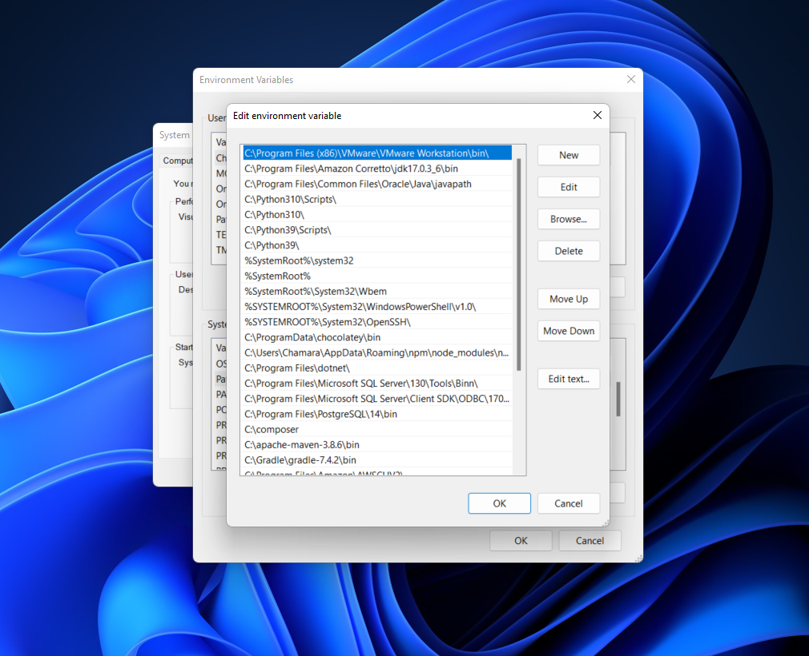

# [SQL Mastery HOME PAGE 🏠](../../README.md)

- [SQL Mastery HOME PAGE 🏠](#sql-mastery-home-page-)
  - [1. Why PostgreSQL 🦊](#1-why-postgresql-)
    - [1.1 Why Postgres is the worlds best database🦊](#11-why-postgres-is-the-worlds-best-database)
  - [2. Environment Tooling 🦊](#2-environment-tooling-)
    - [2.1 Valentina Studio🦊](#21-valentina-studio)
  - [3. SQL Tooling Alternatives🦊](#3-sql-tooling-alternatives)
  - [4. Command Line 101🦊](#4-command-line-101)
    - [4.1 Commandline 101 mac 🦊](#41-commandline-101-mac-)
    - [4.2 Commandline 101 Linux 🦊](#42-commandline-101-linux-)
    - [4.3 Commandline 101 Windows 🦊](#43-commandline-101-windows-)
  - [5. Getting Help With The Setup 🦊](#5-getting-help-with-the-setup-)
  - [6. WINDOWS Setup 🦊](#6-windows-setup-)
    - [6.1 What is the bonjour service 🦊](#61-what-is-the-bonjour-service-)
    - [6.2 Enterprise DB installer 🦊](#62-enterprise-db-installer-)
  - [7. Optional Setting Up Windows For Command Line🦊](#7-optional-setting-up-windows-for-command-line)
  - [8. MAC Setup 🦊](#8-mac-setup-)
    - [8.1 Postgres App🦊](#81-postgres-app)
  - [9. MAC Commandline tools 🦊](#9-mac-commandline-tools-)
  - [10. LINUX Setup🦊](#10-linux-setup)
    - [10.1 Postgres Linux installation🦊](#101-postgres-linux-installation)
    - [10.2 What are virtual machines🦊](#102-what-are-virtual-machines)
  - [11. Importing Data On WINDOWS🦊](#11-importing-data-on-windows)
  - [12. Importing Data On MAC🦊](#12-importing-data-on-mac)
  - [13. Importing Data On LINUX🦊](#13-importing-data-on-linux)

## 1. Why PostgreSQL 🦊

opensource


### 1.1 Why Postgres is the worlds best database🦊

[PostgreSQL is the worlds’ best database](https://www.2ndquadrant.com/en/blog/postgresql-is-the-worlds-best-database/#:~:text=PostgreSQL%20just%20does%20it.,response%20times%20can%20be%20managed.)

## 2. Environment Tooling 🦊

<!-- created a video have to edit it and paste the link in here -->

install postgres


### 2.1 Valentina Studio🦊

[Valentina Studio](https://www.valentina-db.com/en/all-downloads/vstudio)

## 3. SQL Tooling Alternatives🦊

SQL Tooling

Now that we’re kicking into high gear I thought it would be important to elaborate on our SQL tooling choices and alternatives.

In the realm of SQL new tools pop up all the time and depending on the environment you will end up working in it’s important to know outside of the tools we chose what’s out there!
Why did we choose Valentina DB

When it comes to SQL we wanted to give you all the versatility of a tried and true software. Something that is well-regarded and easy to get up and go. Some people will expect "true" experts to use command line and PGAdmin - however our choice was based on multiple criteria:

    Is it cross-platform

    Is it easy to use

    Is it free

    Can it be extended to multiple database providers

We want our students to be able to get comfortable with a tool and use it with whatever database provider they end up trying or learning later on.

Valentina DB is just that, it has the ability to connect to a multitude of different databases, as well as give you the visual tooling and ease of use you would want when starting out.

It also doesn’t hurt that this entire suite of features is free to use! That said there are many alternative out there that boast the exact same feature sets and we would like to highlight those as well.

Alternatives

When you look at the landscape of SQL tooling it can be a bit overwhelming to see the forest through the trees!

That’s what we're here for! Here’s a curated list of tools that we believe are best in class!

1. PG Admin + Command line

pgAdmin is the most popular and feature rich Open Source administration and development platform for PostgreSQL, the most advanced Open Source database in the world. pgAdmin may be used on Linux, Unix, Mac OS X and Windows to manage PostgreSQL 9.2 and above.

This is certainly the most common tooling you will see available, however although our course uses Postgres the majority of the concepts you will learn can be applied to any number of database providers and so we chose not to lock in your knowledge to the Postgres specific tool suite.

https://www.pgadmin.org

2. Datagrip

For those of you that been around the coding block, you’ve probably heard of JetBrains. JetBrains is a company that creates best-in class tooling for many programming languages and such.

On the front of SQL there tooling is no-joke either! Datagrip is widely regarded as a powerhouse when it comes to database management.

With great power comes a great price tag however, as their subscription-based model is no joking matter.

However for the suite of features they offer the cost is often quickly forgotten for the performance you gain as a user!

Feel free to check them out at DataGrip: The Cross-Platform IDE for Databases & SQL by JetBrains 3. DBeaver

DBeaver is straight up one of the most comprehensive free database management studios you will find and has a strong and loyal community backing them.

When it comes to a well-rounded, well-oiled piece of software that can stand the test of time, DBeaver is definitely in that category.

Check them out at DBeaver Community | Free Universal Database Tool 4. Other tools that caught our eye

    GitHub - plotly/falcon: Free, open-source SQL client for Windows and Mac 🦅

    DbVisualizer - The Universal Database Tool

    TablePlus | Modern, Native Tool for Database Management

## 4. Command Line 101🦊

### 4.1 Commandline 101 mac 🦊

### 4.2 Commandline 101 Linux 🦊

[Commandline 101 Linux](https://jgefroh.medium.com/a-beginners-guide-to-linux-command-line-56a8004e2471)

### 4.3 Commandline 101 Windows 🦊

[Commandline 101 Windows](http://ifoundthemeaningoflife.com/learntocode/cmd101win)

## 5. Getting Help With The Setup 🦊

One of the hardest parts of the course is coming up! When it comes to installing different software on your computer, things become complex because there are so many types of computers/configurations and other factors that each of you have. We have tried to make things as simple as possible, but if you encounter any issues with the setup, please reach out to us in the #databases channel on Discord so we can help you out :)

Just remember to not get discouraged. Usually it is common to struggle during the setup and installation phases but once we get it right, it's smooth sailing from there!

## 6. WINDOWS Setup 🦊

### 6.1 What is the bonjour service 🦊

[link](https://softwarekeep.com/help-center/what-is-bonjour-service-on-windows-10)

### 6.2 Enterprise DB installer 🦊

[link](https://www.enterprisedb.com/downloads/postgres-postgresql-downloads)

## 7. Optional Setting Up Windows For Command Line🦊




## 8. MAC Setup 🦊

### 8.1 Postgres App🦊

## 9. MAC Commandline tools 🦊

## 10. LINUX Setup🦊

### 10.1 Postgres Linux installation🦊

### 10.2 What are virtual machines🦊

## 11. Importing Data On WINDOWS🦊

```sql
psql -U postgres -d World < world.sql

psql -U postgres -d Employees < employees.sql

psql -U postgres -d Store < store.sql

psql -U postgres -d France < france.sql
```


## 12. Importing Data On MAC🦊

## 13. Importing Data On LINUX🦊
