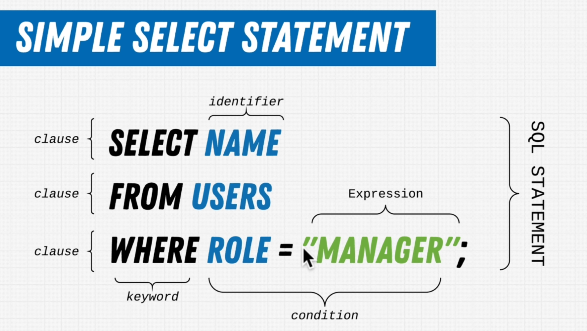
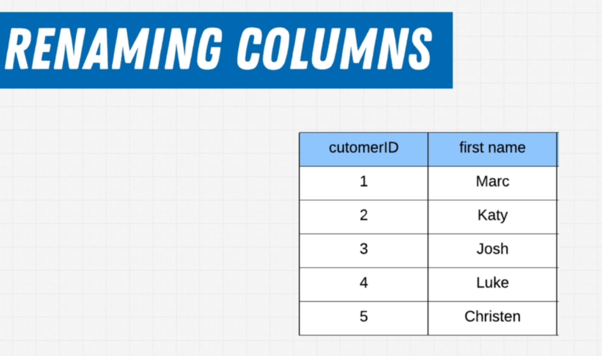
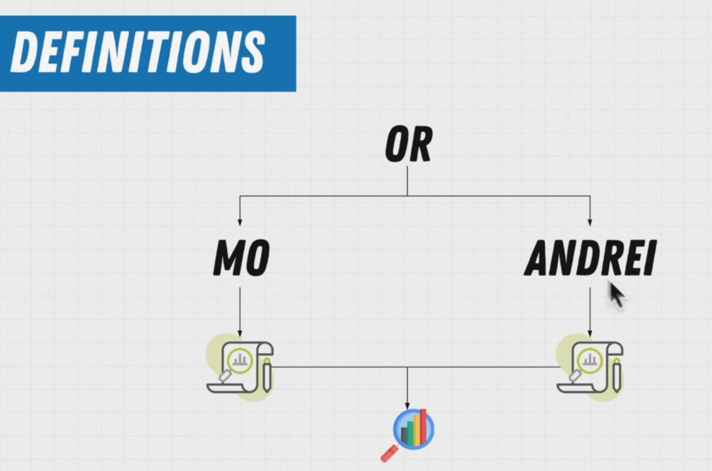
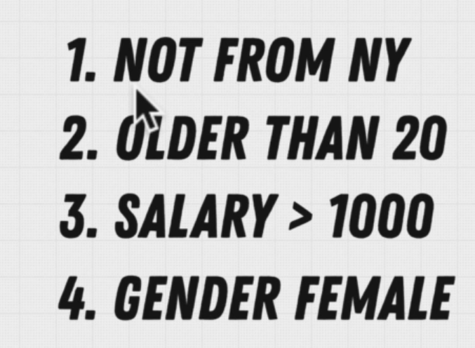
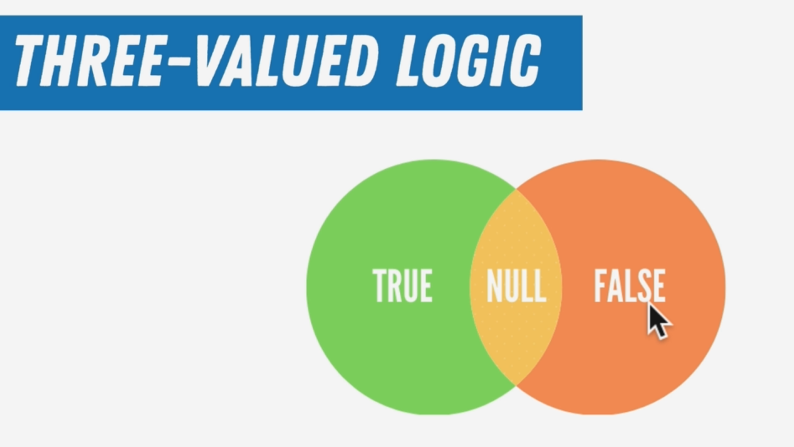
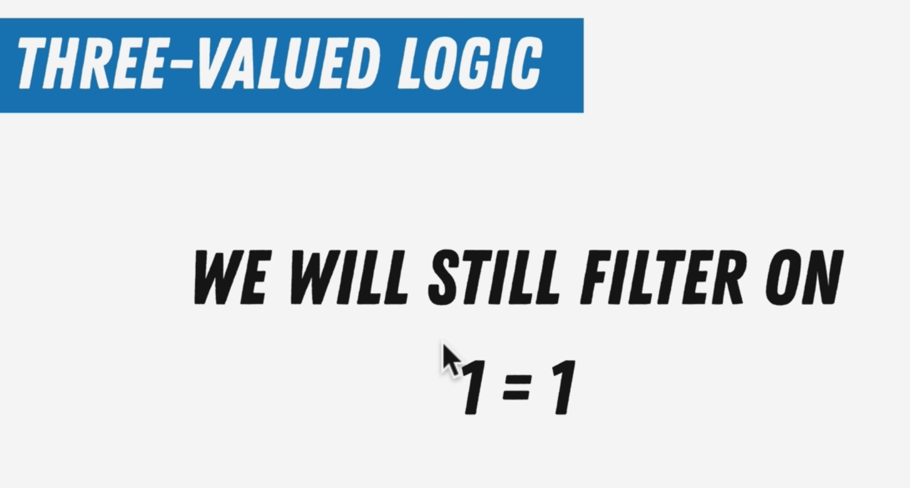
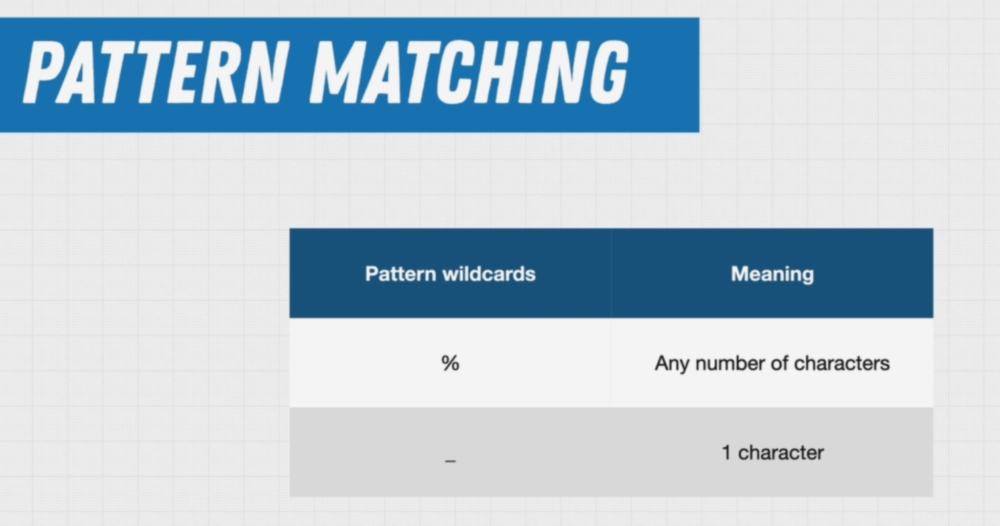
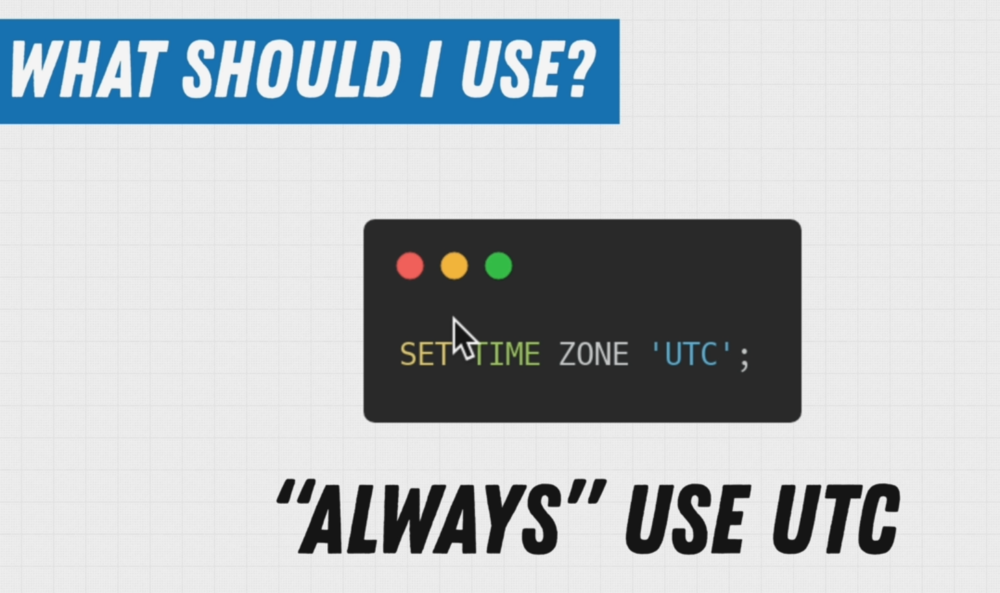

# [SQL Mastery HOME PAGE 🏠](../../README.md)

- [SQL Mastery HOME PAGE 🏠](#sql-mastery-home-page-)
  - [1. Query Along 🐰](#1-query-along-)
  - [2. Starting With Query 🐰](#2-starting-with-query-)
  - [3. Exercise Simple Queries 🐰](#3-exercise-simple-queries-)
  - [4. Exercise Renaming Columns 🐰](#4-exercise-renaming-columns-)
  - [5. Concat Function 🐰](#5-concat-function-)
  - [6. What Is A Function In SQL 🐰](#6-what-is-a-function-in-sql-)
  - [7. Aggregate Functions 🐰](#7-aggregate-functions-)
    - [7.1 Aggregate Functions 🐰](#71-aggregate-functions-)
  - [8. Exercise Aggregate Functions 🐰](#8-exercise-aggregate-functions-)
  - [**output**](#output)
  - [**output**](#output-1)
  - [**output**](#output-2)
  - [**output**](#output-3)
  - [9. Commenting Your Queries 🐰](#9-commenting-your-queries-)
    - [9.1 Make comments the most important code you write! 🐰](#91-make-comments-the-most-important-code-you-write-)
  - [10. Common SELECT Mistakes 🐰](#10-common-select-mistakes-)
  - [11. Filtering Data 🐰](#11-filtering-data-)
  - [**output**](#output-4)
  - [12. AND and OR 🐰](#12-and-and-or-)
  - [**output**](#output-5)
  - [13. Exercise Filtering Data 🐰](#13-exercise-filtering-data-)
  - [14. Exercise The Where Clause 🐰](#14-exercise-the-where-clause-)
  - [15. The NOT Keyword 🐰](#15-the-not-keyword-)
  - [**output**](#output-6)
  - [16. Comparison Operators 🐰](#16-comparison-operators-)
    - [16.1 Comparison Operators 🐰](#161-comparison-operators-)
  - [17. Exercise Comparison Operators 🐰](#17-exercise-comparison-operators-)
  - [**output**](#output-7)
  - [**output**](#output-8)
  - [18. Logical Operators 🐰](#18-logical-operators-)
  - [19. 19. Operator Precedence](#19-19-operator-precedence)
    - [19.1 Operator Precedence](#191-operator-precedence)
    - [19.2 Expression Evaluation Rules](#192-expression-evaluation-rules)
  - [20. Operator Precedence 2](#20-operator-precedence-2)
    - [21. Exercise Operator Precedence](#21-exercise-operator-precedence)
  - [22. Checking For NULL Values](#22-checking-for-null-values)
  - [23. IS Keyword](#23-is-keyword)
  - [24. NULL Coalescing](#24-null-coalescing)
  - [25. Exercise Null Value Coalescing](#25-exercise-null-value-coalescing)
  - [26. 3 Valued Logic](#26-3-valued-logic)
  - [27. Exercise 3 Valued Logic](#27-exercise-3-valued-logic)
  - [28. BETWEEN + AND](#28-between--and)
  - [29. IN Keyword](#29-in-keyword)
  - [30. Exercise IN Keyword](#30-exercise-in-keyword)
  - [31. LIKE](#31-like)
  - [32. Exercise Like Keyword](#32-exercise-like-keyword)
  - [| 10109 | Mariusz | 63 |](#-10109--mariusz--63-)
  - [33. Dates And Timezones](#33-dates-and-timezones)
  - [33.1 UTC is enough right](#331-utc-is-enough-right)
  - [34. Setting Up Timezones](#34-setting-up-timezones)
  - [35. How Do We Format Date And Time](#35-how-do-we-format-date-and-time)
  - [36. Timestamps](#36-timestamps)
  - [37. Date Functions](#37-date-functions)
  - [38. Date Difference And Casting](#38-date-difference-and-casting)
  - [39. Age Calculation](#39-age-calculation)
  - [40. Extracting Information](#40-extracting-information)
  - [41. Intervals](#41-intervals)
  - [42. Exercise Date and Timestamp](#42-exercise-date-and-timestamp)
  - [43. DISTINCT](#43-distinct)
  - [44. Exercise Distinct Keyword](#44-exercise-distinct-keyword)
  - [45. Sorting Data](#45-sorting-data)
  - [46. Multi Table SELECT](#46-multi-table-select)
  - [47. Inner Join](#47-inner-join)
  - [48. Self Join](#48-self-join)
  - [49. Outer Join](#49-outer-join)
  - [50. Less Common Joins](#50-less-common-joins)
  - [51. Inner-Join Exercises](#51-inner-join-exercises)
  - [52. USING Keyword](#52-using-keyword)

## 1. Query Along 🐰

Although we provide exercises throughout the sections, we also recommend that you follow along by also writing out what you see on the screen and trying the SQL commands yourself that we show you. The best way to learn is not by watching us do it, but by practicing the commands yourself. So Query Along!

## 2. Starting With Query 🐰





## 3. Exercise Simple Queries 🐰


```SQL
select * from employees;
```

**output**

| emp_no | birth_date | first_name | last_name | gender | hire_date  |
| :----- | :--------- | :--------- | :-------- | :----- | :--------- |
| 10001  | 1953-09-02 | Georgi     | Facello   | M      | 1986-06-26 |
| 10002  | 1964-06-02 | Bezalel    | Simmel    | F      | 1985-11-21 |


```SQL
select count(*) from departments;
```

**output**

| count |
| :---- |
| 9     |


```SQL
select count(*) AS "Salaray Incremenets"
from salaries
where emp_no = 10001;
```

**output**

| Salaray Incremenets |
| :------------------ |
| 17                  |


```SQL
SELECT title
FROM titles
WHERE emp_no = 10006;
```

**output**

| title           |
| :-------------- |
| Senior Engineer |

## 4. Exercise Renaming Columns 🐰




```SQL
select emp_no AS "Employee #", birth_date AS "Birthday", first_name AS "First Name"
from employees;
```

**output**

| Employee # | Birthday   | First Name |
| :--------- | :--------- | :--------- |
| 10001      | 1953-09-02 | Georgi     |
| 10002      | 1964-06-02 | Bezalel    |
| 10003      | 1959-12-03 | Parto      |
| 10004      | 1954-05-01 | Chirstian  |
| 10005      | 1955-01-21 | Kyoichi    |
| 10006      | 1953-04-20 | Anneke     |
| 10007      | 1957-05-23 | Tzvetan    |
| 10008      | 1958-02-19 | Saniya     |
| 10009      | 1952-04-19 | Sumant     |
| 10010      | 1963-06-01 | Duangkaew  |

## 5. Concat Function 🐰


```SQL
SELECT concat(first_name, ' ', last_name) AS "Full Name"
FROM "Employees".public.employees;
```

**output**

| Full Name          |
| :----------------- |
| Georgi Facello     |
| Bezalel Simmel     |
| Parto Bamford      |
| Chirstian Koblick  |
| Kyoichi Maliniak   |
| Anneke Preusig     |
| Tzvetan Zielinski  |
| Saniya Kalloufi    |
| Sumant Peac        |
| Duangkaew Piveteau |

## 6. What Is A Function In SQL 🐰


## 7. Aggregate Functions 🐰


```SQL
SELECT count(*)
FROM employees;
```

**output**

| count  |
| :----- |
| 300024 |


```SQL
SELECT max(salary)
FROM salaries;
```

**output**

| max    |
| :----- |
| 158220 |

---

```SQL
SELECT sum(salary)
FROM salaries;
```

**output**

| sum          |
| :----------- |
| 181480757419 |

### 7.1 Aggregate Functions 🐰

[postgres 14 aggregate function documentation](https://www.postgresql.org/docs/14/functions-aggregate.html)

## 8. Exercise Aggregate Functions 🐰

Time to sharpen those skills, the following exercises are there to help you flex those SQL muscles you've just built!

In the previous videos we learned a lot about aggregate functions, and how they can help us answer complex questions!

Reminder

Exercises are grouped according to the database the should be executed against, as always our format is <DatabaseName>/<Table> which indicates against which database and table you should be working to get accurate results.

**Question**
What database should I use for these exercises?

```SQL
SELECT avg(salary)
FROM salaries;
```

**output**

| avg                |
| :----------------- |
| 63810.744836143706 |

---

**Question**
What year was the youngest person born in the company?

```SQL
SELECT max(birth_date)
FROM employees;
```

**output**

| max        |
| :--------- |
| 1965-02-01 |

---

**Question**
How many towns are there in france?

```SQL
SELECT count(*)
FROM "France".public.towns;
```

## **output**

| count |
| :---- |
| 36684 |

---

**Question**
How many official languages are there?

```SQL
SELECT count(*)
FROM "World".public.countrylanguage
WHERE isofficial = true;
```

## **output**

| count |
| :---- |
| 238   |

---

**Question**
What is the average life expectancy in the world?

```SQL
SELECT avg(lifeexpectancy)
FROM country;
```

## **output**

| avg               |
| :---------------- |
| 66.48603611164265 |

---

**Question**
What is the average population for cities in the netherlands?

```SQL
SELECT avg(population)
FROM city
WHERE countrycode = 'NLD';
```

## **output**

| avg       |
| :-------- |
| 185001.75 |

---

## 9. Commenting Your Queries 🐰


```SQL
SELECT first_name, last_name
FROM "Employees".public.employees
/*
FILTER ON FIRST NAME AND LAST NAME TO LIMIT THE AMOUNT OF DATA RETURNED
AND FOCUS THE FILTERING ON A SINGLE PERSON
*/
WHERE first_name = 'Mayumi'
  AND last_name = 'Schueller';
```

**output**

| first_name | last_name |
| :--------- | :-------- |
| Mayumi     | Schueller |

### 9.1 Make comments the most important code you write! 🐰

[How to make comments the most important ‘code’ you write](https://www.red-gate.com/simple-talk/databases/oracle-databases/how-to-make-comments-the-most-important-code-you-write/)

## 10. Common SELECT Mistakes 🐰


## 11. Filtering Data 🐰


**Question**


```SQL
SELECT first_name
FROM employees
WHERE gender = 'F' LIMIT 10;
```

## **output**

| first_name |
| :--------- |
| Bezalel    |
| Anneke     |
| Tzvetan    |
| Sumant     |
| Duangkaew  |
| Mary       |
| Cristinel  |
| Kazuhide   |
| Bojan      |
| Suzette    |

## 12. AND and OR 🐰


**Question**

```SQL
SELECT first_name, last_name, gender, hire_date
FROM employees
WHERE (first_name = 'Georgi'
    AND last_name = 'Facello' AND gender = 'M' AND hire_date = '1986-06-26')
   OR (first_name = 'Bezalel' AND
       last_name = 'Simmel');
```

## **output**

| first_name | last_name | gender | hire_date  |
| :--------- | :-------- | :----- | :--------- |
| Georgi     | Facello   | M      | 1986-06-26 |
| Bezalel    | Simmel    | F      | 1985-11-21 |

## 13. Exercise Filtering Data 🐰

**Question**


```SQL
SELECT count(*)
FROM customers
WHERE (state = 'OR' OR state = 'NY')
  AND (gender = 'F');
```

| count |
| :---- |
| 200   |

## 14. Exercise The Where Clause 🐰

[quiz](https://www.w3schools.com/sql/exercise.asp?filename=exercise_where1)

## 15. The NOT Keyword 🐰


**Question**


```SQL
SELECT count(*)
FROM customers
WHERE NOT age = 55;
```

## **output**

| count |
| :---- |
| 19716 |

## 16. Comparison Operators 🐰


### 16.1 Comparison Operators 🐰

[link](https://www.postgresql.org/docs/12/functions-comparison.html)

## 17. Exercise Comparison Operators 🐰

**Question**
Who over the age of 44 has an income of 100 000 or more?

```SQL
SELECT firstname, lastname
FROM customers
WHERE (age > 44)
  AND income > 10000
LIMIT 10;
```

## **output**

| firstname | lastname   |
| :-------- | :--------- |
| VKUUXF    | ITHOMQJNYX |
| HQNMZH    | UNUKXHJVXB |
| JTNRNB    | LYYSHTQJRE |
| FXDZBW    | BAXPEEKXVJ |
| WVZTXZ    | RMEVXCQGQF |
| LIWLAI    | PVGRMMHSEQ |
| NCGWRC    | CJOPRHUHIE |
| XQVVMI    | KRPGDBCQJH |
| AGUQVI    | FFPCRUSFKI |
| SIQANV    | QQNKJSURDA |

---

**Question**
Who between the ages of 30 and 50 has an income of less than 50 000?

```SQL
SELECT firstname, lastname, age, income
FROM customers
WHERE (age >= 30 AND age <= 50)
  AND income < 50000
LIMIT 10;
```

## **output**

| firstname | lastname   | age | income |
| :-------- | :--------- | :-- | :----- |
| XMFYXD    | WQLQHUHLFE | 44  | 40000  |
| FUOHXX    | WMOEHWMMWM | 44  | 40000  |
| HEJLWR    | UKDLCPZCWE | 48  | 20000  |
| UQBLKL    | PVOFURBZMJ | 31  | 40000  |
| ONGTCS    | UDVEXRMKNH | 39  | 40000  |
| AJEMKC    | ZPSLCCVCPI | 47  | 20000  |
| VAWCEX    | AGDCPNPNJZ | 49  | 40000  |
| ZTBECR    | ZZVIFZFDSR | 34  | 40000  |
| CGPUTV    | THGPQDWHTM | 35  | 20000  |
| LADSQO    | JKUESHADGZ | 45  | 20000  |

---

**Question**
What is the average income between the ages of 20 and 50?

```SQL
SELECT avg(income)
FROM customers
WHERE age <= 50
  AND age >= 20;
```

**output**
| avg |
| :--- |
| 59361.925908612832 |

---

**Question**
How many female customers do we have from the state of Oregon (OR) over 20?

```SQL
SELECT COUNT(firstName)
FROM customers
WHERE gender = 'F' and state = 'OR' and age > 20;
```

**output**
| count |
| :--- |
| 103 |

## 18. Logical Operators 🐰





## 19. 19. Operator Precedence


### 19.1 Operator Precedence

[Operator Precedence](https://www.postgresql.org/docs/14/sql-syntax-lexical.html#SQL-PRECEDENCE)

### 19.2 Expression Evaluation Rules

[Expression Evaluation Rules](https://www.postgresql.org/docs/14/sql-expressions.html#SYNTAX-EXPRESS-EVAL)

## 20. Operator Precedence 2





### 21. Exercise Operator Precedence

---

**Question**
Select people either under 30 or over 50 with an income above 50000
Include people that are 50
that are from either Japan or Australia

```SQL
SELECT age, income, country
FROM customers
WHERE (country = 'Japan' OR country = 'Australia')
  AND (age > 50 OR age < 30)
  AND income > 50000
LIMIT 10;

```

**output**
| age | income | country |
| :--- | :--- | :--- |
| 52 | 80000 | Australia |
| 86 | 100000 | Japan |
| 66 | 60000 | Australia |
| 22 | 80000 | Australia |
| 55 | 100000 | Japan |
| 56 | 100000 | Japan |
| 88 | 100000 | Japan |
| 56 | 60000 | Australia |
| 59 | 60000 | Australia |
| 81 | 80000 | Australia |

---

**Question**
What was our total sales in June of 2004 for orders over 100 dollars?

```SQL
SELECT sum(netamount)
FROM orders
WHERE orderdate >= '2004-06-01'
  AND orderdate <= '2004-06-30'
  AND netamount > 100;
```

**output**
| sum |
| :--- |
| 188060.29 |

## 22. Checking For NULL Values


## 23. IS Keyword


## 24. NULL Coalescing


## 25. Exercise Null Value Coalescing

**Question**
Assuming a students minimum age for the class is 15, what is the average age of a student?

```SQL
SELECT avg(coalesce(age, 15))
from "Student";
```

**output**
| avg |
| :--- |
| 30.4000000000000000 |

---

**Question**
Replace all empty first or last names with a default?

```SQL
SELECT coalesce(name, 'fallback'),coalesce(lastname, 'lastname')
from "Student";
```

**output**

## 26. 3 Valued Logic








## 27. Exercise 3 Valued Logic

**Question**
adjust the following query to display the null values as "No Address"

```SQL
SELECT coalesce(address2, 'No Address') AS "Address"
FROM customers
limit 5;
```

**output**
| Address |
| :--- |
| No Address |
| No Address |
| No Address |
| No Address |
| No Address |

---

**Question**
Fix the following query to apply proper 3VL

```SQL
SELECT *
FROM customers
WHERE address2 IS NOT null;

```

---

**Question**
Fix the following query to apply proper 3VL

```SQL
SELECT coalesce(lastName, 'Empty'), age
from customers
where age IS null;
```

## 28. BETWEEN + AND


## 29. IN Keyword


```SQL
SELECT *
FROM "Employees".public.employees
WHERE emp_no IN (10008, 10001, 10003);
```

**output**

| emp_no | birth_date | first_name | last_name | gender | hire_date  |
| :----- | :--------- | :--------- | :-------- | :----- | :--------- |
| 10001  | 1953-09-02 | Georgi     | Facello   | M      | 1986-06-26 |
| 10003  | 1959-12-03 | Parto      | Bamford   | M      | 1986-08-28 |
| 10008  | 1958-02-19 | Saniya     | Kalloufi  | M      | 1994-09-15 |

## 30. Exercise IN Keyword

**Question**
How many orders were made by customer 7888, 1082, 12808, 9623

```SQL
SELECT count(*)
FROM orders
WHERE customerid IN (7888, 1082, 12808, 9623);
```

**output**

| count |
| :---- |
| 6     |

---

**Question**
How many cities are in the district of Zuid-Holland, Noord-Brabant and Utrecht?

```SQL
SELECT count(*)
FROM city
WHERE district IN ('Zuid-Holland', 'Noord-Brabant', 'Utrecht');
```

**output**

| count |
| :---- |
| 12    |

## 31. LIKE





employees who's names are starting with G and End with ger

```SQL
SELECT *
FROM employees
WHERE first_name ILIKE 'g%ger'
LIMIT 10;
```

**output**

| emp\_no | birth\_date | first\_name | last\_name | gender | hire\_date |
| :--- | :--- | :--- | :--- | :--- | :--- |
| 10202 | 1956-01-05 | Greger | Lichtner | M | 1991-10-06 |
| 10422 | 1954-06-02 | Greger | Rubsam | F | 1990-12-07 |
| 11084 | 1955-07-03 | Greger | Senzako | M | 1990-05-31 |
| 13902 | 1954-04-20 | Greger | Kilgore | M | 1993-07-04 |
| 13935 | 1961-07-20 | Greger | Gopalakrishnan | F | 1988-05-16 |
| 14848 | 1957-06-14 | Greger | Tagansky | M | 1997-05-27 |
| 16740 | 1957-08-17 | Greger | Oehlmann | M | 1986-03-06 |
| 18171 | 1957-11-26 | Greger | Litzler | M | 1995-05-24 |
| 25772 | 1952-03-11 | Greger | Marrevee | M | 1988-04-09 |
| 26293 | 1963-02-06 | Greger | Peyn | F | 1994-12-24 |

## 32. Exercise Like Keyword

**Question**
Find the age of all employees who's name starts with M.

```SQL
SELECT emp_no, first_name, EXTRACT(YEAR FROM age(birth_date)) AS "age"
FROM employees
WHERE first_name LIKE 'M%'
LIMIT 10;
```

**output**
| emp\_no | first\_name | age |
| :--- | :--- | :--- |
| 10011 | Mary | 68 |
| 10020 | Mayuko | 69 |
| 10042 | Magy | 66 |
| 10044 | Mingsen | 61 |
| 10045 | Moss | 65 |
| 10054 | Mayumi | 65 |
| 10069 | Margareta | 62 |
| 10074 | Mokhtar | 67 |
| 10077 | Mona | 58 |
| 10109 | Mariusz | 63 |
---
**Question**
How many people's name start with A and end with R?

```SQL
SELECT count(*)
FROM employees
WHERE first_name ILIKE 'A%R';
```

**output**

| count |
| :--- |
| 1846 |

---

**Question**
How many people's zipcode have a 2 in it?.

```SQL
SELECT count(*)
FROM customers
WHERE zip::text LIKE '%2%';
```

**output**

| count |
| :--- |
| 4211 |

---

**Question**
How many people's zipcode start with 2 with the 3rd character being a 1.

```SQL
SELECT count(*)
FROM customers
WHERE zip::text LIKE '2_1%';
```

**output**
| count |
| :--- |
| 109 |

---

**Question**
Which states have phone numbers starting with 302?

```SQL
SELECT phone, COALESCE(state, 'No State')
FROM customers
WHERE phone::text LIKE '302%';
```

**output**

| phone | coalesce |
| :--- | :--- |
| 3029418206 | DE |
| 3021789304 | MT |
| 3026419807 | FL |
| 3026303076 | MT |
| 3023624404 | NH |
| 3026653788 | NE |
| 3028183531 | DE |
| 3027434499 | AL |
| 3029948454 | NE |
| 3024827254 | OK |
| 3023877961 | AR |
| 3028920560 | IL |
| 3028070970 | MD |
| 3028738895 | IA |
| 3026901691 | NY |
| 3020804778 | No State |
| 3026850792 | No State |
| 3023953968 | No State |
| 3028282136 | No State |
| 3026231256 | No State |
| 3028971317 | No State |
| 3021694672 | No State |
| 3024863329 | No State |

## 33. Dates And Timezones


this will set the time zone for the current session



to see the time zone

```sql
SHOW TIMEZONE ;
```

**output**

| TimeZone |
| :--- |
| UTC |

## 33.1 UTC is enough right

[UTC is enough right](https://zachholman.com/talk/utc-is-enough-for-everyone-right)

## 34. Setting Up Timezones

let's set up postgres so every session for the postgres user will show dates in UTC

```SQL
-- BY DEFAULT POSTGRES WILL SAVE EVERYTHING IN UTC
-- THIS IS FOR THE SESSION
SET TIME ZONE 'UTC';

SHOW TIMEZONE ;
-- ALL OUR FUTURE SESSIONS WILL BE IN UTC
ALTER USER postgres SET timezone = 'UTC';

SHOW TIMEZONE;


```

**output**

| TimeZone |
| :--- |
| UTC |

## 35. How Do We Format Date And Time


## 36. Timestamps


```SQL
SELECT now();
```

**output**

| now |
| :--- |
| 2022-09-22 04:57:14.158483 +00:00 |

let's create a table to store Timestamps

```sql
-- CREATE THE TABLE
CREATE TABLE timezones
(
    ts TIMESTAMP WITHOUT TIME ZONE,
    tz TIMESTAMP WITH TIME ZONE
);

-- ADD DATA
INSERT INTO timezones
VALUES (TIMESTAMP WITHOUT TIME ZONE '2000-01-01 10:00:00-5',
        TIMESTAMP WITH TIME ZONE '2000-01-01 10:00:00-5');
-- GET THE DATA
SELECT *
FROM timezones;
```

**output**

| ts | tz |
| :--- | :--- |
| 2000-01-01 10:00:00.000000 | 2000-01-01 15:00:00.000000 +00:00 |

here we can see the without the time stam is storing the data without using the time zone values which is incorrect in most senarios but when we are using the timezons postgres take the value into account.

## 37. Date Functions

```SQL
-- TO GET THE CURRENT DATE
SELECT now()::date;
SELECT CURRENT_DATE;

-- TO FORMAT THE DATE
SELECT now();
SELECT to_char(now(),'dd/mm/yyyy');
```


**output**

| to\_char |
| :--- |
| 22/09/2022 |

## 38. Date Difference And Casting


```SQL
SELECT now() - '1800/01/01' AS "time in days";
```

**output**

| time in days |
| :--- |
| 0 years 0 mons 81349 days 2 hours 27 mins 44.177417 secs |

---

```SQL
-- WE ARE CASTING THE '' TO A DATE
SELECT DATE '1800/01/01';
SELECT '1800/01/01'::date;
```

**output**

| date |
| :--- |
| 1800-01-01 |


## 39. Age Calculation

## 40. Extracting Information

## 41. Intervals

## 42. Exercise Date and Timestamp

## 43. DISTINCT

## 44. Exercise Distinct Keyword

## 45. Sorting Data

## 46. Multi Table SELECT

## 47. Inner Join

## 48. Self Join

## 49. Outer Join

## 50. Less Common Joins

## 51. Inner-Join Exercises

## 52. USING Keyword
