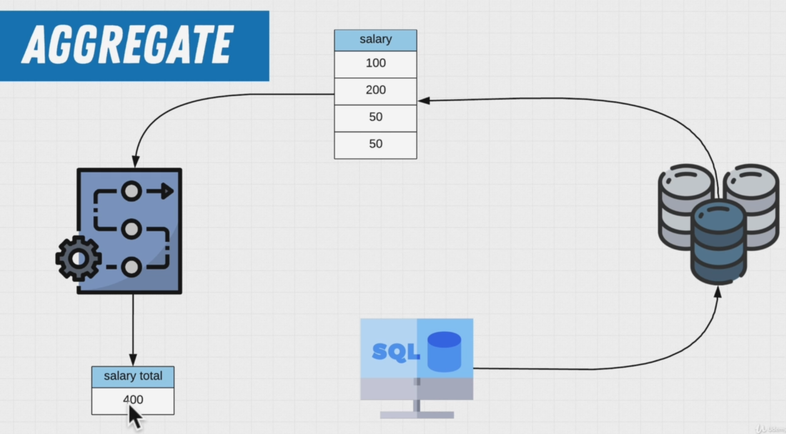

# [SQL Mastery HOME PAGE 🏠](../../README.md)

## 1. Query Along 🐰

Although we provide exercises throughout the sections, we also recommend that you follow along by also writing out what you see on the screen and trying the SQL commands yourself that we show you. The best way to learn is not by watching us do it, but by practicing the commands yourself. So Query Along!

## 2. Starting With Query 🐰


## 3. Exercise Simple Queries 🐰


```SQL
select * from employees;
```

**output**

| emp_no | birth_date | first_name | last_name | gender | hire_date  |
| :----- | :--------- | :--------- | :-------- | :----- | :--------- |
| 10001  | 1953-09-02 | Georgi     | Facello   | M      | 1986-06-26 |
| 10002  | 1964-06-02 | Bezalel    | Simmel    | F      | 1985-11-21 |


```SQL
select count(*) from departments;
```

**output**

| count |
| :---- |
| 9     |


```SQL
select count(*) AS "Salaray Incremenets"
from salaries
where emp_no = 10001;
```

**output**

| Salaray Incremenets |
| :------------------ |
| 17                  |


```SQL
SELECT title
FROM titles
WHERE emp_no = 10006;
```

**output**

| title           |
| :-------------- |
| Senior Engineer |

## 4. Exercise Renaming Columns 🐰


```SQL
select emp_no AS "Employee #", birth_date AS "Birthday", first_name AS "First Name"
from employees;
```

**output**

| Employee # | Birthday   | First Name |
| :--------- | :--------- | :--------- |
| 10001      | 1953-09-02 | Georgi     |
| 10002      | 1964-06-02 | Bezalel    |
| 10003      | 1959-12-03 | Parto      |
| 10004      | 1954-05-01 | Chirstian  |
| 10005      | 1955-01-21 | Kyoichi    |
| 10006      | 1953-04-20 | Anneke     |
| 10007      | 1957-05-23 | Tzvetan    |
| 10008      | 1958-02-19 | Saniya     |
| 10009      | 1952-04-19 | Sumant     |
| 10010      | 1963-06-01 | Duangkaew  |

## 5. Concat Function 🐰


```SQL
SELECT concat(first_name, ' ', last_name) AS "Full Name"
FROM "Employees".public.employees;
```

**output**

| Full Name          |
| :----------------- |
| Georgi Facello     |
| Bezalel Simmel     |
| Parto Bamford      |
| Chirstian Koblick  |
| Kyoichi Maliniak   |
| Anneke Preusig     |
| Tzvetan Zielinski  |
| Saniya Kalloufi    |
| Sumant Peac        |
| Duangkaew Piveteau |

## 6. What Is A Function In SQL 🐰





## 7. Aggregate Functions 🐰

### 7.1 Aggregate Functions 🐰

## 8. Exercise Aggregate Functions 🐰

## 9. Commenting Your Queries 🐰

### 9.1 Make comments the most important code you write! 🐰

## 10. Common SELECT Mistakes 🐰

## 11. Filtering Data 🐰

## 12. AND and OR 🐰

## 13. Exercise Filtering Data 🐰

## 14. Exercise The Where Clause 🐰

## 15. The NOT Keyword 🐰

## 16. Comparison Operators 🐰

### 16.1 Comparison Operators 🐰

## 17. Exercise Comparison Operators 🐰

## 18. Logical Operators 🐰
