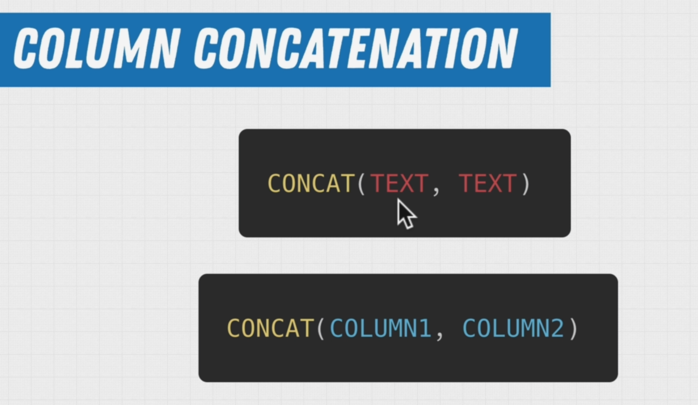
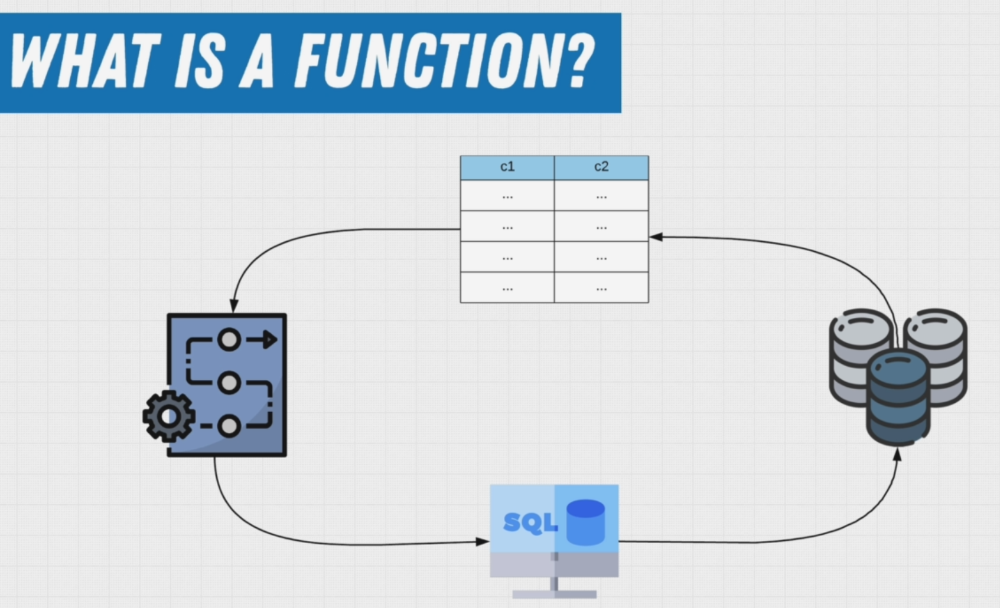
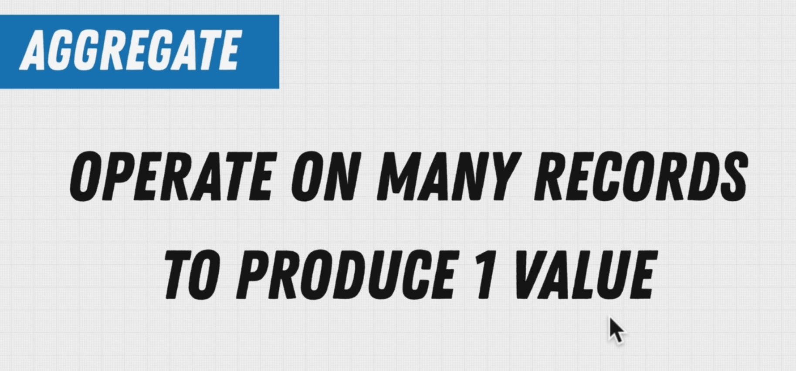
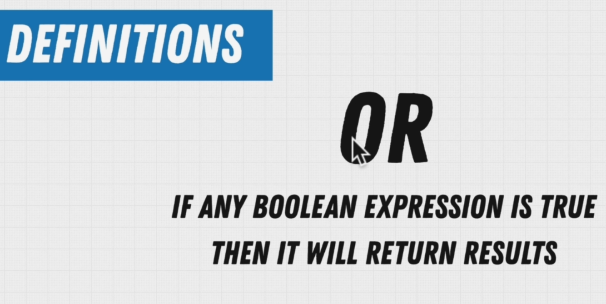
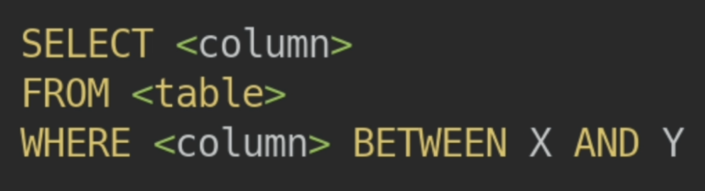
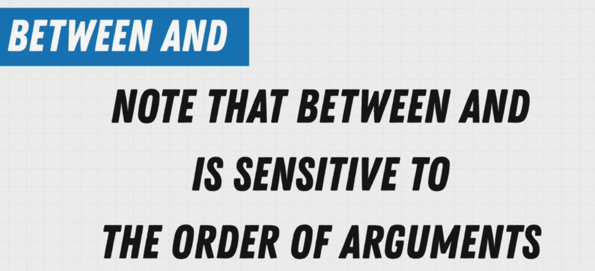

# [SQL Mastery HOME PAGE 🏠](../../README.md)

## 1. Query Along 🐰

Although we provide exercises throughout the sections, we also recommend that you follow along by also writing out what you see on the screen and trying the SQL commands yourself that we show you. The best way to learn is not by watching us do it, but by practicing the commands yourself. So Query Along!

## 2. Starting With Query 🐰


## 3. Exercise Simple Queries 🐰


```SQL
select * from employees;
```

**output**

| emp_no | birth_date | first_name | last_name | gender | hire_date  |
| :----- | :--------- | :--------- | :-------- | :----- | :--------- |
| 10001  | 1953-09-02 | Georgi     | Facello   | M      | 1986-06-26 |
| 10002  | 1964-06-02 | Bezalel    | Simmel    | F      | 1985-11-21 |


```SQL
select count(*) from departments;
```

**output**

| count |
| :---- |
| 9     |


```SQL
select count(*) AS "Salaray Incremenets"
from salaries
where emp_no = 10001;
```

**output**

| Salaray Incremenets |
| :------------------ |
| 17                  |


```SQL
SELECT title
FROM titles
WHERE emp_no = 10006;
```

**output**

| title           |
| :-------------- |
| Senior Engineer |

## 4. Exercise Renaming Columns 🐰


```SQL
select emp_no AS "Employee #", birth_date AS "Birthday", first_name AS "First Name"
from employees;
```

**output**

| Employee # | Birthday   | First Name |
| :--------- | :--------- | :--------- |
| 10001      | 1953-09-02 | Georgi     |
| 10002      | 1964-06-02 | Bezalel    |
| 10003      | 1959-12-03 | Parto      |
| 10004      | 1954-05-01 | Chirstian  |
| 10005      | 1955-01-21 | Kyoichi    |
| 10006      | 1953-04-20 | Anneke     |
| 10007      | 1957-05-23 | Tzvetan    |
| 10008      | 1958-02-19 | Saniya     |
| 10009      | 1952-04-19 | Sumant     |
| 10010      | 1963-06-01 | Duangkaew  |

## 5. Concat Function 🐰




```SQL
SELECT concat(first_name, ' ', last_name) AS "Full Name"
FROM "Employees".public.employees;
```

**output**

| Full Name          |
| :----------------- |
| Georgi Facello     |
| Bezalel Simmel     |
| Parto Bamford      |
| Chirstian Koblick  |
| Kyoichi Maliniak   |
| Anneke Preusig     |
| Tzvetan Zielinski  |
| Saniya Kalloufi    |
| Sumant Peac        |
| Duangkaew Piveteau |

## 6. What Is A Function In SQL 🐰







## 7. Aggregate Functions 🐰


```SQL
SELECT count(*)
FROM employees;
```

**output**

| count  |
| :----- |
| 300024 |


```SQL
SELECT max(salary)
FROM salaries;
```

**output**

| max    |
| :----- |
| 158220 |

---

```SQL
SELECT sum(salary)
FROM salaries;
```

**output**

| sum          |
| :----------- |
| 181480757419 |

### 7.1 Aggregate Functions 🐰

[postgres 14 aggregate function documentation](https://www.postgresql.org/docs/14/functions-aggregate.html)

## 8. Exercise Aggregate Functions 🐰

Time to sharpen those skills, the following exercises are there to help you flex those SQL muscles you've just built!

In the previous videos we learned a lot about aggregate functions, and how they can help us answer complex questions!

Reminder

Exercises are grouped according to the database the should be executed against, as always our format is <DatabaseName>/<Table> which indicates against which database and table you should be working to get accurate results.

**Question**
What database should I use for these exercises?

```SQL
SELECT avg(salary)
FROM salaries;
```

**output**

| avg                |
| :----------------- |
| 63810.744836143706 |

---

**Question**
What year was the youngest person born in the company?

```SQL
SELECT max(birth_date)
FROM employees;
```

**output**

| max        |
| :--------- |
| 1965-02-01 |

---

**Question**
How many towns are there in france?

```SQL
SELECT count(*)
FROM "France".public.towns;
```

## **output**

| count |
| :---- |
| 36684 |

---

**Question**
How many official languages are there?

```SQL
SELECT count(*)
FROM "World".public.countrylanguage
WHERE isofficial = true;
```

## **output**

| count |
| :---- |
| 238   |

---

**Question**
What is the average life expectancy in the world?

```SQL
SELECT avg(lifeexpectancy)
FROM country;
```

## **output**

| avg               |
| :---------------- |
| 66.48603611164265 |

---

**Question**
What is the average population for cities in the netherlands?

```SQL
SELECT avg(population)
FROM city
WHERE countrycode = 'NLD';
```

## **output**

| avg       |
| :-------- |
| 185001.75 |

---

## 9. Commenting Your Queries 🐰


```SQL
SELECT first_name, last_name
FROM "Employees".public.employees
/*
FILTER ON FIRST NAME AND LAST NAME TO LIMIT THE AMOUNT OF DATA RETURNED
AND FOCUS THE FILTERING ON A SINGLE PERSON
*/
WHERE first_name = 'Mayumi'
  AND last_name = 'Schueller';
```

**output**

| first_name | last_name |
| :--------- | :-------- |
| Mayumi     | Schueller |

### 9.1 Make comments the most important code you write! 🐰

[How to make comments the most important ‘code’ you write](https://www.red-gate.com/simple-talk/databases/oracle-databases/how-to-make-comments-the-most-important-code-you-write/)

## 10. Common SELECT Mistakes 🐰


## 11. Filtering Data 🐰


**Question**


```SQL
SELECT first_name
FROM employees
WHERE gender = 'F' LIMIT 10;
```

## **output**

| first_name |
| :--------- |
| Bezalel    |
| Anneke     |
| Tzvetan    |
| Sumant     |
| Duangkaew  |
| Mary       |
| Cristinel  |
| Kazuhide   |
| Bojan      |
| Suzette    |

## 12. AND and OR 🐰


**Question**

```SQL
SELECT first_name, last_name, gender, hire_date
FROM employees
WHERE (first_name = 'Georgi'
    AND last_name = 'Facello' AND gender = 'M' AND hire_date = '1986-06-26')
   OR (first_name = 'Bezalel' AND
       last_name = 'Simmel');
```

## **output**

| first_name | last_name | gender | hire_date  |
| :--------- | :-------- | :----- | :--------- |
| Georgi     | Facello   | M      | 1986-06-26 |
| Bezalel    | Simmel    | F      | 1985-11-21 |

## 13. Exercise Filtering Data 🐰

**Question**


```SQL
SELECT count(*)
FROM customers
WHERE (state = 'OR' OR state = 'NY')
  AND (gender = 'F');
```

| count |
| :---- |
| 200   |

## 14. Exercise The Where Clause 🐰

[quiz](https://www.w3schools.com/sql/exercise.asp?filename=exercise_where1)

## 15. The NOT Keyword 🐰


**Question**


```SQL
SELECT count(*)
FROM customers
WHERE NOT age = 55;
```

## **output**

| count |
| :---- |
| 19716 |

## 16. Comparison Operators 🐰


### 16.1 Comparison Operators 🐰

[link](https://www.postgresql.org/docs/12/functions-comparison.html)

## 17. Exercise Comparison Operators 🐰

**Question**
Who over the age of 44 has an income of 100 000 or more?

```SQL
SELECT firstname, lastname
FROM customers
WHERE (age > 44)
  AND income > 10000
LIMIT 10;
```

## **output**

| firstname | lastname   |
| :-------- | :--------- |
| VKUUXF    | ITHOMQJNYX |
| HQNMZH    | UNUKXHJVXB |
| JTNRNB    | LYYSHTQJRE |
| FXDZBW    | BAXPEEKXVJ |
| WVZTXZ    | RMEVXCQGQF |
| LIWLAI    | PVGRMMHSEQ |
| NCGWRC    | CJOPRHUHIE |
| XQVVMI    | KRPGDBCQJH |
| AGUQVI    | FFPCRUSFKI |
| SIQANV    | QQNKJSURDA |

---

**Question**
Who between the ages of 30 and 50 has an income of less than 50 000?

```SQL
SELECT firstname, lastname, age, income
FROM customers
WHERE (age >= 30 AND age <= 50)
  AND income < 50000
LIMIT 10;
```

## **output**

| firstname | lastname   | age | income |
| :-------- | :--------- | :-- | :----- |
| XMFYXD    | WQLQHUHLFE | 44  | 40000  |
| FUOHXX    | WMOEHWMMWM | 44  | 40000  |
| HEJLWR    | UKDLCPZCWE | 48  | 20000  |
| UQBLKL    | PVOFURBZMJ | 31  | 40000  |
| ONGTCS    | UDVEXRMKNH | 39  | 40000  |
| AJEMKC    | ZPSLCCVCPI | 47  | 20000  |
| VAWCEX    | AGDCPNPNJZ | 49  | 40000  |
| ZTBECR    | ZZVIFZFDSR | 34  | 40000  |
| CGPUTV    | THGPQDWHTM | 35  | 20000  |
| LADSQO    | JKUESHADGZ | 45  | 20000  |

---

**Question**
What is the average income between the ages of 20 and 50?

```SQL
SELECT avg(income)
FROM customers
WHERE age <= 50
  AND age >= 20;
```

**output**
| avg |
| :--- |
| 59361.925908612832 |

---

**Question**
How many female customers do we have from the state of Oregon (OR) over 20?

```SQL
SELECT COUNT(firstName)
FROM customers
WHERE gender = 'F' and state = 'OR' and age > 20;
```

**output**
| count |
| :--- |
| 103 |

## 18. Logical Operators 🐰





## 19. 19. Operator Precedence


### 19.1 Operator Precedence

[Operator Precedence](https://www.postgresql.org/docs/14/sql-syntax-lexical.html#SQL-PRECEDENCE)

### 19.2 Expression Evaluation Rules

[Expression Evaluation Rules](https://www.postgresql.org/docs/14/sql-expressions.html#SYNTAX-EXPRESS-EVAL)

## 20. Operator Precedence 2


### 21. Exercise Operator Precedence

---

**Question**
Select people either under 30 or over 50 with an income above 50000
Include people that are 50
that are from either Japan or Australia

```SQL
SELECT age, income, country
FROM customers
WHERE (country = 'Japan' OR country = 'Australia')
  AND (age > 50 OR age < 30)
  AND income > 50000
LIMIT 10;

```

**output**
| age | income | country |
| :--- | :--- | :--- |
| 52 | 80000 | Australia |
| 86 | 100000 | Japan |
| 66 | 60000 | Australia |
| 22 | 80000 | Australia |
| 55 | 100000 | Japan |
| 56 | 100000 | Japan |
| 88 | 100000 | Japan |
| 56 | 60000 | Australia |
| 59 | 60000 | Australia |
| 81 | 80000 | Australia |

---

**Question**
What was our total sales in June of 2004 for orders over 100 dollars?

```SQL
SELECT sum(netamount)
FROM orders
WHERE orderdate >= '2004-06-01'
  AND orderdate <= '2004-06-30'
  AND netamount > 100;
```

**output**
| sum |
| :--- |
| 188060.29 |

## 22. Checking For NULL Values


## 23. IS Keyword


## 24. NULL Coalescing


## 25. Exercise Null Value Coalescing

**Question**
Assuming a students minimum age for the class is 15, what is the average age of a student?

```SQL
SELECT avg(coalesce(age, 15))
from "Student";
```

**output**
| avg |
| :--- |
| 30.4000000000000000 |

---

**Question**
Replace all empty first or last names with a default?

```SQL
SELECT coalesce(name, 'fallback'),coalesce(lastname, 'lastname')
from "Student";
```

**output**

## 26. 3 Valued Logic


## 27. Exercise 3 Valued Logic

**Question**
adjust the following query to display the null values as "No Address"

```SQL
SELECT coalesce(address2, 'No Address') AS "Address"
FROM customers
limit 5;
```

**output**
| Address |
| :--- |
| No Address |
| No Address |
| No Address |
| No Address |
| No Address |

---

**Question**
Fix the following query to apply proper 3VL

```SQL
SELECT *
FROM customers
WHERE address2 IS NOT null;

```

---

**Question**
Fix the following query to apply proper 3VL

```SQL
SELECT coalesce(lastName, 'Empty'), age
from customers
where age IS null;
```

## 28. BETWEEN + AND








## 29. IN Keyword


## 30. Exercise IN Keyword

## 31. LIKE

## 32. Exercise Like Keyword

## 33. Dates And Timezones

## 33.1 UTC is enough right

## 34. Setting Up Timezones

## 35. How Do We Format Date And Time

## 36. Timestamps

## 37. Date Functions

## 38. Date Difference And Casting

## 39. Age Calculation

## 40. Extracting Information

## 41. Intervals

## 42. Exercise Date and Timestamp

## 43. DISTINCT

## 44. Exercise Distinct Keyword

## 45. Sorting Data

## 46. Multi Table SELECT

## 47. Inner Join

## 48. Self Join

## 49. Outer Join

## 50. Less Common Joins

## 51. Inner-Join Exercises

## 52. USING Keyword
